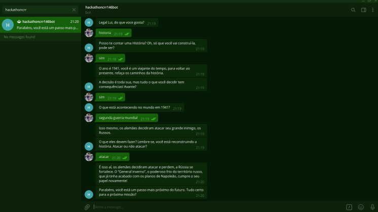

# Hackathon CRR Team 146 Telegram Bot

> Chatbot

**Área** Educação

**Público-alvo:** jovens de 15 à 16 anos 

**Software base:** API Telegram
In: https://core.telegram.org/api

**Username:** @hackathoncrr146bot
___

A interação humana nos tem sido restrita no contexto de pandemia. Quem nos motiva? Quem nos auxilia quando temos dificuldades? Alguns dos profissionais que antes estavam presencialmente conosco muitas vezes tem estado "do outro lado da tela". Neste sentido se faz necessário criar fontes de incentivo e empoderamento para que os jovens sintam-se acolhidos e possam se desenvolver.
Chatboots são tecnologias de comunicação que podem ser personalizadas para executar diferentes tarefas digitais. Através da comunicação humano e chatbot somos capazes de compreender realidades subjetivas e personalizar a interação para desenvolvimento de competências humanas pelo incentivo à práticas de estudos.

No fluxo de narrativa com este chatbot você será instigado a pensar sobre a correlação entre as diferentes competências da BNCC com sua vida cotidiana por meio de um RPG (Role-playing game), uma gamificação. De maneira lúdica, aprendendo novos conteúdos com o Bot e ensinando também à ele.

O objetivo é estimular a pesquisa por parte dos jovens para realizar buscas direcionadas à conteúdos educativos. Personificado como um amigo, o bot dialoga buscando conhecê-lo para à partir de uma análise de sentimentos realizar perguntas que o incentive a pensar em problemas baseados nas competências da BNCC.

**Ref BNCC** In: http://basenacionalcomum.mec.gov.br/images/BNCC_EI_EF_110518_versaofinal_site.pdf 

Ao **ensinar o bot** uma nova informação você associa uma palavra-chave à uma resposta. As palavras-chave podem ser uma pergunta ou um comando, por exemplo. As respostas podem ser texto e/ou link da internet. Através desta funcionalidade é possível construir suas próprias narrativas!

Ensinar ao bot é interessante como dinâmica de memorização, é uma forma de ensinarmos através do bot como fazer as perguntas certas para problemas objetivos.

Para ensinarmos precisamos estar dispostos a aprender juntos!
O fluxo de aprendizagem possibilita que sua interação trilhe uma **Viagem no Tempo**.
___
>**Imersão:** _Viagem no Tempo_

**Bot** O que está acontecendo no mundo em 1941?

_Fluxo de diálogo:_

A imersão em conteúdos da BNCC ludicamente favorece o desenvolvimento do jovem porque torna-se possível aprender brincando. Nós acreditamos que a experiência de estudar pode ser interessante. Acreditamos que é possível criar novas formas de interagir adaptadas às necessidades singulares da humanidade, valorizando a diversidade que existe em nós e a nossa capacidade de aprender e ensinar criando experiências disruptivas.

Que tal escrever a história da sua vida?
Se desenvolver ensinando um bot a pensar... 

___

## Prerequisitos de uso

Ter o python 3.8 instalado
Ter o pip instalado (normalmente vem junto com o python)

## Instruções de uso

1. Faça uma copia do arquivo `.env.template` e renomeie para `.env`
2. No `.env` coloque o TOKEN do bot do telegram e de um nome para ele
3. Rodar `pip install -U python-dotenv` e `pip install python-telegram-bot --upgrade` e `pip install Unidecode`
4. rode `python main.py`
